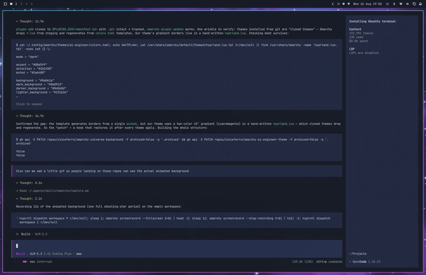

# AI Engineer — an Omarchy theme




A glowing neon "AI engineer universe" theme for [Omarchy](https://omarchy.org):
deep-space backgrounds, electric cyan accent, purple/pink neon terminals.


## What's inside

- **Neon palette** — deep-space backgrounds (`#0a0e1a`), cyan accent (`#00e5ff`),
  pink/purple brights tuned for terminals and the status bar
- **Backgrounds** — `2-nebula`, `3-neural` (a glowing AI network), `4-eclipse`
  (a neon-rimmed dark planet), plus `1-universe-live.webp`, the trigger for the
  [animated shader wallpaper](https://github.com/vinceferro/omarchy-universe-background)
  if you have that plugin installed (otherwise it's a pretty static frame)
- **Lock screen** — dark starfield with neon borders
- **Icons** — Yaru-purple-dark

## Install

One-liner (plugin + theme + gradient borders + live background pin):

```bash
curl -sL https://gist.githubusercontent.com/vinceferro/14ca89b1f493986cff81a81721ac8670/raw/install.sh | bash
```

Or step by step with the native commands:

```bash
omarchy plugin add https://github.com/vinceferro/omarchy-universe-background.git --enable
omarchy plugin disable omarchy.background
omarchy theme install https://github.com/vinceferro/omarchy-ai-engineer-theme.git
```

The theme ships `hooks/theme-set.d/ai-engineer.sh`; install it so the
customizations survive every theme apply:

```bash
mkdir -p ~/.config/omarchy/hooks/theme-set.d
cp ~/.config/omarchy/themes/ai-engineer/hooks/theme-set.d/ai-engineer.sh ~/.config/omarchy/hooks/theme-set.d/
chmod +x ~/.config/omarchy/hooks/theme-set.d/ai-engineer.sh
omarchy theme set ai-engineer
omarchy restart shell
```

> Why the hook: Omarchy regenerates a cloned theme's `hyprland.lua` on every
> apply (Lua is code, so it is dropped and rebuilt from `colors.toml`), which
> loses this theme's cyan→magenta gradient borders — and applying a theme
> cycles to the next background by default, dropping the live one
> (basecamp/omarchy#8431). The hook restores both after each apply.

## License

MIT
